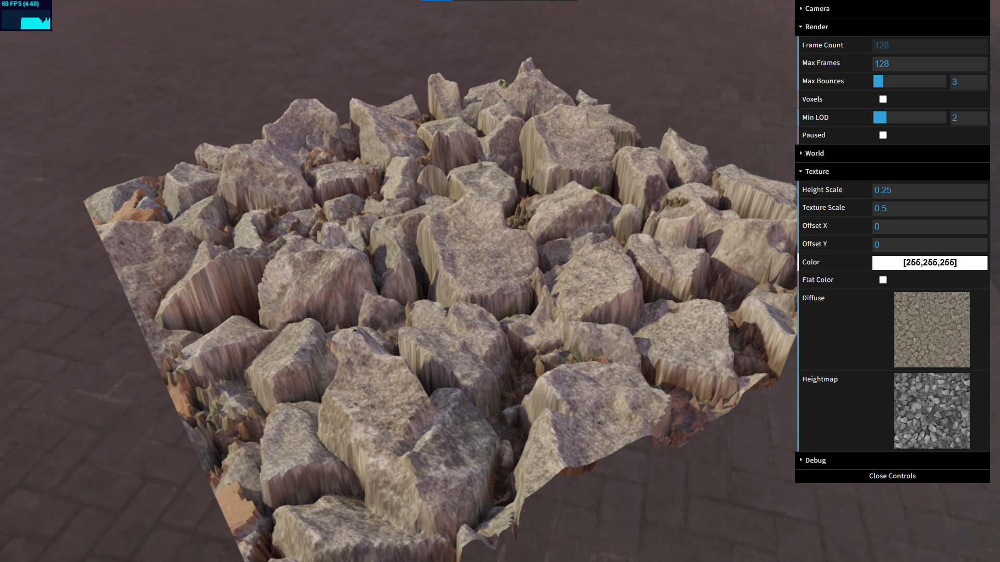

# Heightmap Pathtracing using Quadtree Displacement Mapping

https://gelamisalami.github.io/Quadtree-Displacement-Mapping/

Rendering heightmaps with path tracing on a subdivided plane using quadtree displacement mapping. The heightmap is stored as a min-max mipmap hierarchy which is used to traverse the heightmap as an implicit quadtree acceleration structure.

## Resources

[Quadtree Displacement Mapping with Height Blending](https://www.gamedevs.org/uploads/quadtree-displacement-mapping-with-height-blending.pdf)  
Original presentation on the algorithm

[Tessellation-Free Displacement Mapping for Ray Tracing](https://perso.telecom-paristech.fr/boubek/papers/TFDM/)  
Most recent paper which uses same concept to apply displacement mapping on arbitrary triangle meshes

[Ray-intersection functions by Inigo Quilez](https://iquilezles.org/articles/intersectors/)  

[Rock textures](https://polyhaven.com/a/gray_rocks) and [HDRI](https://polyhaven.com/a/the_sky_is_on_fire) from [PolyHaven](https://polyhaven.com/)